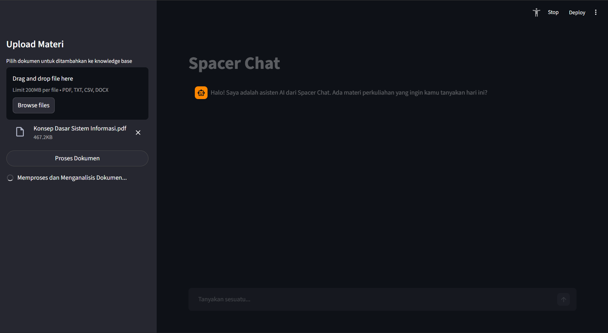
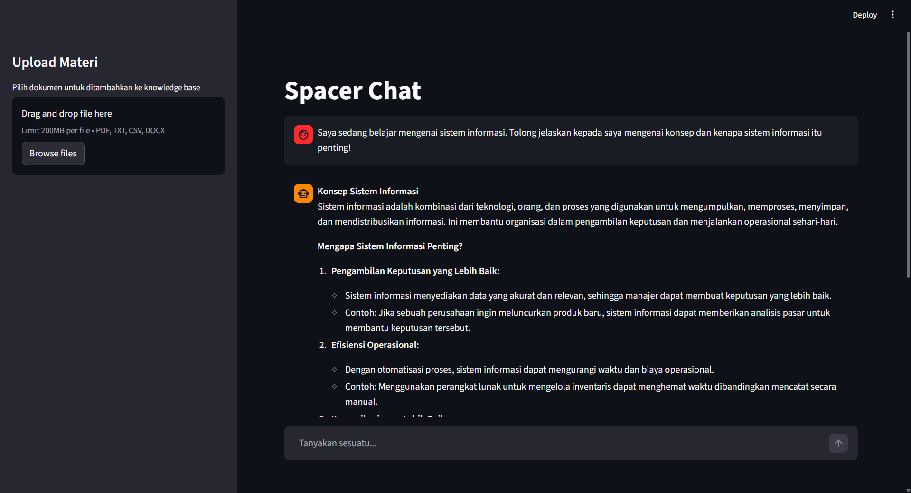
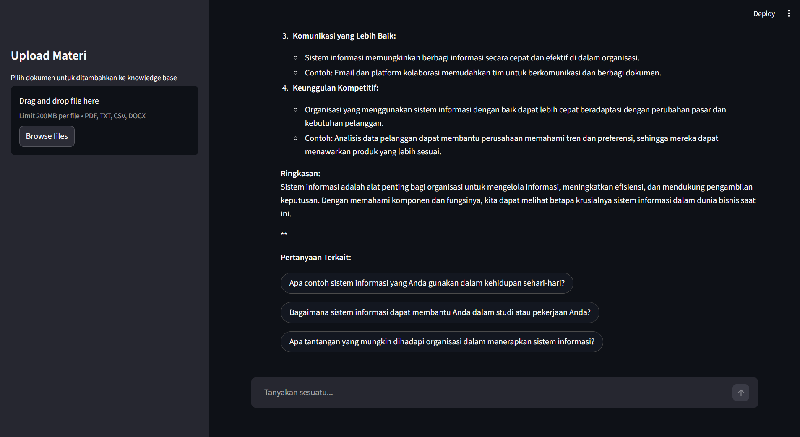

# Spacer Chat

Spacer Chat is a Retrieval-Augmented Generation (RAG) powered educational chatbot designed to help students understand course materials. It combines a FastAPI backend with a Streamlit user interface to provide an intelligent learning tutor that answers questions based on uploaded documents.

## Screenshots

### Document Upload
Upload course materials through the sidebar. The system supports PDF, TXT, CSV, and DOCX files up to 200MB. Documents are automatically processed and indexed into the vector database.

<p align="center">
  
</p>

### Chat Interface
Ask questions about your course materials. The AI tutor provides structured explanations with examples, summaries, and step-by-step breakdowns to help you understand the concepts.

<p align="center">
  
</p>

### Follow-up Questions
Each response includes suggested follow-up questions to encourage deeper exploration of the topic. Click any suggestion to continue the conversation.

<p align="center">
  
</p>

## Features

- **Document Ingestion**: Upload PDF documents to build a knowledge base
- **RAG-Powered Responses**: Uses LangChain with OpenAI-compatible APIs for context-aware answers
- **Smart Question Suggestions**: Provides up to 3 related follow-up questions to encourage deeper learning
- **REST API Backend**: FastAPI endpoints for programmatic access
- **Interactive UI**: Streamlit-based chat interface for easy interaction
- **Evaluation Framework**: Built-in RAGAS evaluation for measuring response quality

## Technology Stack

| Component | Technology |
|-----------|------------|
| Backend Framework | FastAPI |
| Frontend | Streamlit |
| LLM Integration | LangChain, LangChain-OpenAI |
| Vector Database | TiDB Vector |
| Embeddings | HuggingFace (BAAI/bge-m3) |
| Document Processing | PyPDF |
| Evaluation | RAGAS (Faithfulness, Context Precision) |
| Server | Uvicorn |

## Project Structure

```
spacer-chat/
├── app/
│   ├── config.py              # Application settings (Pydantic)
│   └── isrgrootx1.pem         # TiDB SSL certificate
├── rag/
│   ├── chain.py               # RAG chain orchestration
│   ├── memory.py              # Conversation memory
│   └── core/
│       ├── generation/
│       │   ├── generator.py   # LLM response generation
│       │   └── chat_prompt.json  # Prompt configuration
│       ├── indexing/
│       │   ├── indexer.py     # Document indexing pipeline
│       │   └── cleaner.py     # Document cleaning utilities
│       └── retrieval/
│           └── retriever.py   # Vector similarity search
├── schemas/
│   └── chat_response.py       # Response models
├── evaluation/
│   ├── evaluation.ipynb       # RAGAS evaluation notebook
│   └── test_data.json         # Test dataset
├── data/                      # Document storage
├── main.py                    # FastAPI application entry point
├── streamlit_app.py           # Streamlit UI
├── pyproject.toml             # Project dependencies
└── .env.example               # Environment template
```

## Requirements

- Python 3.12 or higher
- TiDB Serverless account (for vector storage)
- OpenAI API key or OpenRouter API key

## Installation

1. Clone the repository:
```bash
git clone <repository-url>
cd spacer-chat
```

2. Create and configure environment variables:
```bash
cp .env.example .env
```

3. Edit `.env` with your configuration:
```env
# LLM Configuration
OPENAI_API_KEY=your_api_key
OPENAI_BASE_URL=https://openrouter.ai/api/v1
MODEL_NAME=openai/gpt-4o-mini
EMBEDDING_MODEL=BAAI/bge-m3

# TiDB Configuration
HOST=your_tidb_host
PORT=4000
DB_USERNAME=your_username
DB_PASSWORD=your_password
DATABASE=spacer_chat
TABLE_NAME=embedded_documents
CA_PATH=app/isrgrootx1.pem

# Processing Configuration
CHUNK_SIZE=1000
CHUNK_OVERLAP=200
```

4. Install dependencies using uv:
```bash
uv sync
```

Or with pip:
```bash
pip install .
```

## Running the Application

### Streamlit Interface (Recommended)

```bash
streamlit run streamlit_app.py
```

Access the chat interface at `http://localhost:8501`

### FastAPI Backend

```bash
python main.py
```

Or using uvicorn directly:
```bash
uvicorn main:app --reload --host 0.0.0.0 --port 8000
```

The API will be available at:
- API Root: `http://localhost:8000`
- Swagger Documentation: `http://localhost:8000/docs`
- Health Check: `http://localhost:8000/health`

## API Reference

### GET /
Returns service information and available endpoints.

### GET /health
Health check endpoint.

**Response:**
```json
{
  "status": "ok",
  "service": "spacer-chat"
}
```

### POST /ask
Main chat endpoint for asking questions.

**Request:**
```json
{
  "question": "What is machine learning?"
}
```

**Response:**
```json
{
  "content": "Machine learning is a branch of artificial intelligence...",
  "suggested_questions": [
    "What are the types of machine learning?",
    "How does supervised learning work?",
    "What is the difference between classification and regression?"
  ]
}
```

## Usage Guide

1. **Start the Application**: Launch the Streamlit interface
2. **Upload Documents**: Use the sidebar to upload PDF course materials
3. **Ask Questions**: Type your question in the chat input
4. **Explore Further**: Click on suggested questions to continue learning

## Architecture

### RAG Pipeline

The RAG system follows this workflow:

1. **Indexing Phase**
   - Documents are loaded and cleaned
   - Text is split into chunks (1000 chars with 200 overlap)
   - Chunks are embedded using BAAI/bge-m3 model
   - Embeddings are stored in TiDB Vector

2. **Query Phase**
   - User question is embedded
   - Similar chunks are retrieved (top 5, threshold 0.5)
   - Context is formatted and passed to LLM
   - Response is generated with suggested questions

### Prompt Configuration

The generator uses a configurable prompt system (`chat_prompt.json`) with:
- **Persona**: Learning tutor
- **Style Rules**: Simple language, helpful explanations, analogies
- **Guardrails**: Answer only from context, no fabrication
- **Output Format**: Markdown with suggested questions

## Evaluation

The project includes a RAGAS evaluation framework in `evaluation/`:

```python
# Run evaluation notebook
jupyter notebook evaluation/evaluation.ipynb
```

Metrics evaluated:
- **Faithfulness**: Measures if answers are grounded in context
- **Context Precision**: Measures relevance of retrieved context

Sample results:
- Faithfulness Mean: 0.71
- Context Precision Mean: 0.89

## Troubleshooting

| Issue | Solution |
|-------|----------|
| TiDB connection failed | Verify HOST, DB_USERNAME, DB_PASSWORD in .env |
| API key errors | Check OPENAI_API_KEY is valid |
| Embedding model download slow | First run downloads ~2GB model, wait for completion |
| No relevant documents found | Ensure documents are indexed before querying |

## Dependencies

Key dependencies (see `pyproject.toml` for full list):
- fastapi >= 0.129.0
- langchain >= 1.2.10
- langchain-openai >= 1.1.10
- streamlit >= 1.55.0
- tidb-vector >= 0.0.15
- sentence-transformers >= 5.2.3
- ragas >= 0.4.3
- pypdf >= 6.7.1

## Files to Exclude from Repository

The following files and folders should not be pushed to the repository:

| File/Folder | Reason |
|-------------|--------|
| `.env` | Contains sensitive API keys and database credentials |
| `.venv/` | Virtual environment, should be recreated locally |
| `__pycache__/` | Python bytecode cache, auto-generated |
| `*.pyc` | Compiled Python files |
| `.ipynb_checkpoints/` | Jupyter notebook checkpoints |
| `data/` | May contain large or private documents |
| `*.pem` | SSL certificates (except public certs if needed) |
| `.python-version` | Local Python version config (optional) |
| `uv.lock` | Dependency lock file (optional, depends on team preference) |

Ensure your `.gitignore` includes:

```gitignore
# Environment
.env
.venv/
venv/

# Python
__pycache__/
*.py[cod]
*.pyo
.ipynb_checkpoints/

# Data (optional - remove if you want to track documents)
data/

# IDE
.vscode/
.idea/

# OS
.DS_Store
Thumbs.db
```

## License

This project is provided for educational purposes.